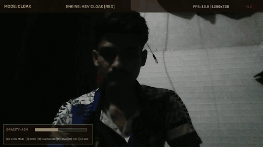
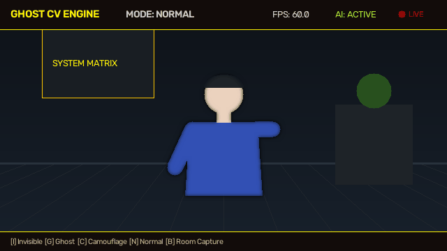
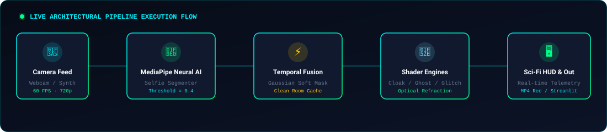

<p align="center">
  
</p>

<p align="center">
  <a href="https://ghostinvisibilitycv-rbonydra6lyf47ppxg5atj.streamlit.app/">
    
  </a>
  
  
  
  
  
  
</p>

<p align="center">
  <b>A production-grade, real-time Computer Vision system delivering neural human segmentation, clean room background auto-capture, active optical camouflage, and instant invisibility cloaking from any live camera feed.</b>
</p>

<p align="center">
  
</p>

## 🎬 Live Showcases & Demos

<table align="center" width="100%">
  <tr>
    <td align="center" width="50%">
      <b>🖥️ Real-Time Sci-Fi HUD &amp; Telemetry</b><br/><br/>
      
    </td>
    <td align="center" width="50%">
      <b>🔮 Multi-Mode Visual FX &amp; Cloaking</b><br/><br/>
      
    </td>
  </tr>
</table>

<p align="center">
  
</p>

## ⚡ Live Architectural Execution Flow

The system runs a modular 5-stage neural computer vision pipeline designed for sub-millisecond per-frame inference and real-time 30+ FPS execution:

<p align="center">
  
</p>

1. **Camera Feed Ingestion**: Captures high-frame-rate frames from built-in webcams, mobile cameras via WiFi/USB (Link to Windows, DroidCam), or automated synthetic fallback generators.
2. **MediaPipe Neural AI**: Runs convolutional neural networks for human body isolation, identifying head, hair, torso, arms, hands, and legs without background corruption.
3. **Temporal Fusion & Clean Room Cache**: Automatically monitors room presence. When you step aside for 1–3 seconds, it captures a 5-frame noise-averaged snapshot of your room and synchronizes ambient exposure.
4. **Multi-Mode Shader Engines**: Renders 100% Invisibility, Active Camouflage refraction, Spectral Ghost trails, Cyan/Magenta Neon auras, or digital scanline glitches.
5. **Sci-Fi HUD & Export**: Overlays responsive real-time telemetry, 3-second countdown reticles, and streams output to window, MP4 video, or Streamlit Cloud web interface.

<p align="center">
  
</p>

## 🌟 Key Features

- **🫥 100% True Human Invisibility**: Isolates human body contours and seamlessly substitutes the actual room background behind the subject. Zero gray blur, zero background distortion.
- **⏱️ 3-Second Smart Room Capture**: Press **`B`** to trigger an on-screen 3-second countdown. Step aside for 3s to capture your actual room without yourself in it.
- **⚡ Active Optical Camouflage**: Sci-Fi Predator-style cloaking that bends and refracts the live background across the body contour using Sobel gradient displacement mapping.
- **🖼️ Instant Virtual Room Presets**: Press **`P`** to cycle through pre-rendered room environments (`CLEAN_ROOM`, `MODERN_STUDIO`, `CYBERPUNK_ROOM`, `DEEP_SPACE`) if you cannot step away from your camera.
- **💡 Ambient Lighting & Color Adaptation**: Dynamically calculates luminance differences between the live camera and the saved background, ensuring seamless lighting consistency.
- **⌨️ Pure Keyboard Control**: No CPU-heavy gesture recognition lag. All commands execute instantaneously via keyboard hotkeys at 30+ FPS.
- **🌐 Streamlit Cloud Web Application**: Deployed live on Streamlit Community Cloud featuring an animated glassmorphism dark theme and 1-click controls.

<p align="center">
  
</p>

## ⌨️ Keyboard Controls Reference

| Key | Mode / Function | Description |
|:---:|:---|:---|
| **`I`** | **100% Invisibility** | Vanish completely into your real room background |
| **`B`** | **3s Room Capture** | Triggers 3-second countdown to step aside and capture your clean room |
| **`P`** | **Cycle Presets** | Switch between Clean Room, Modern Studio, Cyberpunk, & Deep Space |
| **`C`** | **Active Camouflage** | Transparent refraction cloak (bends background through body) |
| **`G`** | **Spectral Ghost** | Semi-transparent ethereal ghost with motion trail queue |
| **`N`** | **Normal View** | Returns to standard camera feed |
| **`S`** | **Screenshot** | Saves timestamped screenshot to `outputs/screenshots/` |
| **`Q` / ESC** | **Quit** | Cleanly exits application |

<p align="center">
  
</p>

## 🚀 Quick Start Guide

### 1. Clone & Install Dependencies

```bash
git clone https://github.com/dhruvshukla4518/Ghost_Invisibility_CV.git
cd Ghost_Invisibility_CV

# Create and activate virtual environment (recommended)
python -m venv venv
venv\Scripts\activate     # Windows
# source venv/bin/activate  # macOS / Linux

# Install dependencies
pip install -r requirements.txt
```

### 2. Run Desktop Application

```bash
# Default built-in webcam
python main.py

# External or Mobile Camera (e.g. DroidCam, Link to Windows)
python main.py --camera 1

# Automated synthetic camera test mode (no physical camera needed)
python main.py --synthetic
```

### 3. How to Vanish in 3 Steps:

1. Launch `python main.py --camera 1`.
2. Press **`B`**: An on-screen 3-second countdown will start (`STEP OUT OF CAMERA VIEW: 3... 2... 1...`).
3. **Step aside for 3 seconds** so the camera captures your empty room.
4. Step back in front of the camera and press **`I`**: **You vanish into your room with crisp, high-definition background!**

---

### 🌐 Run Streamlit Web Application

To run the web application locally:
```bash
streamlit run app.py
```
Or view the live cloud web app at:  
👉 **[ghostinvisibilitycv.streamlit.app](https://ghostinvisibilitycv-rbonydra6lyf47ppxg5atj.streamlit.app/)**

<p align="center">
  
</p>

## 🧪 Automated Testing & Verification

Run the comprehensive unit test suite:

```bash
python -m pytest tests/ -v
```

```
============================== 12 passed in 5.42s ==============================
tests/test_background.py ...   [PASS]
tests/test_blending.py ....    [PASS]
tests/test_mask.py ..          [PASS]
tests/test_segmentation.py ... [PASS]
```

<p align="center">
  
</p>

## 📁 Repository Architecture

```
Ghost_Invisibility_CV/
├── app.py                      # Streamlit Cloud web application
├── main.py                     # Desktop OpenCV application entry point
├── config.py                   # Centralized configuration & keybindings
├── requirements.txt            # Python dependencies
├── packages.txt                # Debian Linux system dependencies
├── pytest.ini                  # PyTest configuration
├── test_pipeline.py            # End-to-end integration test script
├── assets/                     # Animated SVGs, demo GIFs, and model weights
│   ├── ghost_banner_animated.svg   # Animated neon header banner
│   ├── animated_divider.svg        # Laser beam animated section divider
│   ├── pipeline_animated.svg       # Glowing architectural pipeline diagram
│   ├── demo_realtime_hud.gif       # Real-time HUD showcase GIF
│   ├── demo_modes_showcase.gif     # FX cloaking showcase GIF
│   ├── selfie_segmenter.tflite     # MediaPipe AI neural model
│   └── backgrounds/
│       └── clean_background.png    # Auto-saved room background cache
├── src/                        # Core Computer Vision Engine
│   ├── __init__.py             # Source package definitions
│   ├── background.py           # Clean room capture & virtual presets
│   ├── blending.py             # 100% Invisibility & Active Camouflage refraction
│   ├── camera.py               # Robust camera wrapper with synthetic fallback
│   ├── ghost_effect.py         # Multi-mode shader rendering engine
│   ├── hud.py                  # HUD banner with 3-second countdown overlay
│   ├── mask_processing.py      # Morphology, contour filtering & feathering
│   └── segmentation.py         # Pure MediaPipe AI human body isolation
├── tests/                      # Automated test suite (12 unit tests)
└── outputs/                    # Exported screenshots and video recordings
```

<p align="center">
  
</p>

## 📜 License & Credits

Distributed under the MIT License. Built with ❤️ by **[Dhruv Shukla](https://github.com/dhruvshukla4518)**.  
Powered by **OpenCV** &amp; **Google MediaPipe**.
